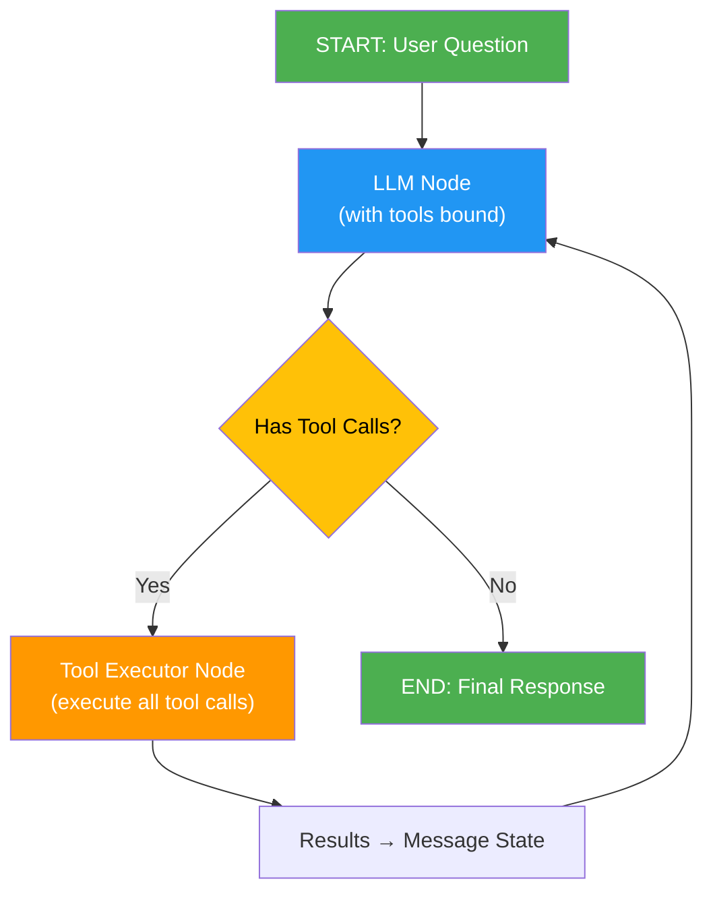

# Input Helper Project 

This project implements an advanced **Question-Answering (Q\&A)** system over **PSR SDDP** energy planning models. The core goal is to enable both technical and non-technical users to query complex study data using **natural language**, leveraging an intelligent **agentic AI** that autonomously selects and executes the right tools to find answers.

-----

## 🎯 Core Approach

The **PSR Study Agent** is a **tool-based agentic AI** powered by **LangGraph** that combines:

* **Intelligence:** Uses advanced LLMs (GPT-4, Claude, etc.) to understand natural language questions and decide which tools to call
* **Flexibility:** Direct API access to PSR study data—no intermediate translations needed, just pure data queries
* **Autonomy:** The agent iteratively calls tools, processes results, and refines answers without human intervention
* **Explainability:** Each tool is purpose-built for a specific data retrieval pattern (filtering, counting, aggregating)

Unlike the previous Cypher-based approach, this system directly queries the study using specialized tools, making it **faster**, **more maintainable**, and **easier to extend**.

-----

## 🧩 Key Components

| Component | Function | Technology |
| :--- | :--- | :--- |
| **PSR Study API** | Direct access to study objects, properties, and relationships via `psr.factory` | **PSR Factory / Python SDK** |
| **LLM Model** | Understands user questions and orchestrates tool calls | **OpenAI GPT-4 / Anthropic Claude / Others** |
| **Tool Suite** | 10+ specialized tools for data retrieval, filtering, counting, and aggregation | **LangChain Tools** |
| **Agent Workflow** | Manages the flow: LLM → tool selection → execution → response refinement | **LangGraph** |
| **System Prompt** | Guides the LLM on tool capabilities and best practices | **YAML Config (agent.yaml)** |

-----

## 🛠️ Available Tools

The agent has access to 10 specialized tools for querying PSR SDDP studies:

### 1. **retrive_properties** 
Retrieves detailed information about available object types and their properties.
- **Use when:** Starting a query session, need to understand what data is available
- **Returns:** Documentation of all object types, mandatory properties, static/dynamic properties, references

### 2. **get_available_names**
Lists all instances of a given object type in the study.
- **Args:** `object_type` (e.g., 'ThermalPlant', 'HydroPlant', 'Bus')
- **Returns:** List of all object names/identifiers of that type
- **Use when:** Need to see what instances exist before filtering

### 3. **count_objects_by_type**
Counts how many objects of a given type exist in the study.
- **Args:** `object_type`
- **Returns:** Integer count
- **Use when:** Quick count queries (e.g., "How many systems?")

### 4. **find_by_name**
Finds a specific object by its exact name.
- **Args:** `object_type`, `name`
- **Returns:** The matching object
- **Use when:** Looking for a specific named object (e.g., 'Plant_ABC')

### 5. **get_static_property**
Retrieves static property values for objects.
- **Args:** `object_type`, `property_name`, `object_name` (optional)
- **Returns:** Dictionary of `{object_name: property_value}` pairs
- **Use when:** Need specific property data (e.g., installed capacity, voltage)

### 6. **find_by_property_condition**
Filters objects by a numeric property condition.
- **Args:** `object_type`, `property_name`, `property_condition` ('l'/<, 'e'/=, 'g'/>), `condition_value`
- **Returns:** List of matching objects
- **Use when:** Finding all plants with capacity > 500, buses with voltage <= 400, etc.

### 7. **count_by_property_condition**
Counts objects matching a property condition.
- **Args:** Same as find_by_property_condition
- **Returns:** Integer count
- **Use when:** "How many plants have capacity > 100?"

### 8. **sum_by_property_condition**
Sums a property across filtered objects.
- **Args:** Same as find_by_property_condition
- **Returns:** Numeric sum
- **Use when:** "What is total capacity of plants > 500?"

### 9. **find_by_reference**
Finds objects linked to a specific reference object.
- **Args:** `object_type`, `reference_type` (e.g., 'RefFuels'), `reference_name` (e.g., 'Natural_Gas')
- **Returns:** List of objects with that reference
- **Use when:** Finding all thermal plants using a specific fuel, generators on a bus, etc.

### 10. **count_by_reference**
Counts objects linked to a specific reference.
- **Args:** Same as find_by_reference
- **Returns:** Integer count
- **Use when:** "How many thermal plants use coal?"

### 11. **sum_property_by_reference**
Sums a property across objects linked to a reference.
- **Args:** `object_type`, `reference_type`, `reference_name`, `property`
- **Returns:** Numeric sum
- **Use when:** "Total capacity of plants using Natural_Gas?"

-----

## ⚙️ LangGraph Workflow

The agent workflow is a **state machine** that loops until the answer is found:



### Workflow Stages

#### Stage 1: **LLM Decision** 
- LLM receives user question + system prompt + all previous messages
- LLM sees available tools via `.bind_tools()`
- LLM generates one or more **tool_calls**
- Example: For "How many systems?", LLM calls `count_objects_by_type("System")`

#### Stage 2: **Tool Execution**
- Executor node receives `tool_calls` from LLM response
- Each tool is invoked with its arguments
- Results are wrapped in `ToolMessage` objects
- Added back to message state

#### Stage 3: **Loop or End**
- If LLM response has tool_calls → return to Stage 1 (continue loop)
- If LLM response has NO tool_calls → end workflow, return final answer

### Example Flow: "How many thermal plants use natural gas?"

```
1. User: "How many thermal plants use natural gas?"
   ↓
2. LLM sees question + tools
   → Decides to call: count_by_reference("ThermalPlant", "RefFuels", "Natural_Gas")
   ↓
3. Tool Executor runs the tool
   → Returns: 42
   ↓
4. LLM generates final response
   → "There are 42 thermal plants that use natural gas in this study."
   → No more tool_calls needed
   ↓
5. Workflow ends, response printed
```

-----

## 📝 System Prompt & Configuration

The agent behavior is defined in `agent.yaml`:

```yaml
system_prompt_template: |
  You are an expert AI assistant specialized in analyzing PSR SDDP studies.
  You have access to 11 specialized tools...
  
  ## WORKFLOW:
  1. Understand the user's question
  2. Use retrive_properties FIRST if unsure about available data
  3. Call appropriate tools to retrieve/filter/aggregate data
  4. Provide clear answers with context
```

The system prompt is loaded at startup and injected into every LLM call, guiding the agent's behavior.

-----

## 🚀 How to Run

### Command Line

```bash
python RAG.py \
    -m gpt-4.1 \
    -s /path/to/your/sddp/study \
    -q "How many thermal plants have capacity greater than 500?"
```

**Arguments:**
- `-m, --model`: LLM model to use (default: gpt-4.1)
  - Supported: gpt-4.1, gpt-4.1-mini, o3, claude-4-sonnet, deepseek-reasoner, local_land
- `-s, --study_path`: Path to your PSR SDDP study files (required)
- `-q, --query`: Natural language question (required)

### Example Queries

```bash
# Count query
python RAG.py -s /path/study -q "How many systems does this case have?"

# Filtering query
python RAG.py -s /path/study -q "Show me all thermal plants with capacity > 100"

# Reference query
python RAG.py -s /path/study -q "How many thermal plants use coal?"

# Aggregation query
python RAG.py -s /path/study -q "What is the total installed capacity of hydro plants?"
```

### Environment Setup

1. Create a Python virtual environment:
```bash
python -m venv venv
source venv/Scripts/activate  # On Windows
```

2. Install dependencies:
```bash
pip install -r requirements.txt
```

3. Set environment variables:
```bash
# .env file
OPENAI_API_KEY=your_api_key_here
ANTHROPIC_API_KEY=your_anthropic_key  # If using Claude
```

-----

## 📊 Workflow Details

### Message State Management

The agent maintains a conversation state:

```python
class AgentState(TypedDict):
    messages: Annotated[list[AnyMessage], operator.add]  # Add messages (no replacement)
```

Each interaction adds:
1. **AIMessage** - LLM response (may contain tool_calls)
2. **ToolMessage** - Tool execution results

Messages accumulate, giving context for refinement.

### Tool Binding

```python
# In RAGAgent.__init__:
self.model = model.bind_tools(tools)
```

This tells the LLM:
- What tools exist
- What parameters each tool expects  
- What each tool does (from docstrings)

The LLM then generates `tool_calls` in its structured response.

### Conditional Routing

```python
def exists_action(self, state: AgentState):
    result = state['messages'][-1]
    return len(result.tool_calls) > 0  # True if tools called, False if done
```

Routes based on whether LLM made tool calls.

-----

## 🔄 Agent Initialization Flow

```python
# 1. Load configuration
SYSTEM_PROMPT_TEMPLATE = load_agent_config("agent.yaml")

# 2. Initialize LLM
llm = ChatOpenAI(model_name="gpt-4.1", ...)

# 3. Define tools
tools = [retrive_properties, get_available_names, ..., sum_property_by_reference]

# 4. Create agent with bound tools
agent = RAGAgent(llm, tools, SYSTEM_PROMPT_TEMPLATE)

# 5. Invoke workflow
result = agent.workflow.invoke({'messages': [HumanMessage(content=user_input)]})

# 6. Extract answer
final_response = result['messages'][-1].content
```

-----

## 🛑 Current Limitations & Future Development

### Current Limitations

* **Single Study:** Agent works with one loaded study at a time. Multi-study comparison not yet supported.
* **Tool Latency:** Large studies with thousands of objects may experience slower tool execution (no indexing optimizations).
* **Limited Error Handling:** Tool errors are returned as text; the agent may need multiple attempts to clarify.
* **No Dynamic Tool Creation:** Tools are fixed at startup; can't define new tools mid-session.

### Future Development Pipeline

| Priority | Task | Description |
| :--- | :--- | :--- |
| **High** | **Tool Performance** | Add caching/indexing for large studies; profile tool execution times |
| **High** | **Error Recovery** | Improve error messages so LLM can self-correct without restarting |
| **High** | **Documentation Tool** | Add a tool that returns detailed docs on properties, relationships dynamically |
| **Medium** | **Multi-Study Support** | Allow loading multiple studies and querying across them |
| **Medium** | **Memory/State Persistence** | Cache study metadata between runs to speed up initialization |
| **Medium** | **Custom Tools** | Allow users to define domain-specific tools dynamically |
| **Low** | **Streaming Output** | Support token-by-token streaming for real-time response display |
| **Low** | **Visualization** | Add tools that generate charts/plots from query results |

