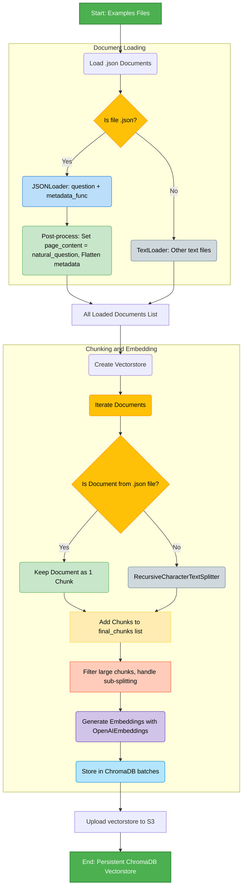
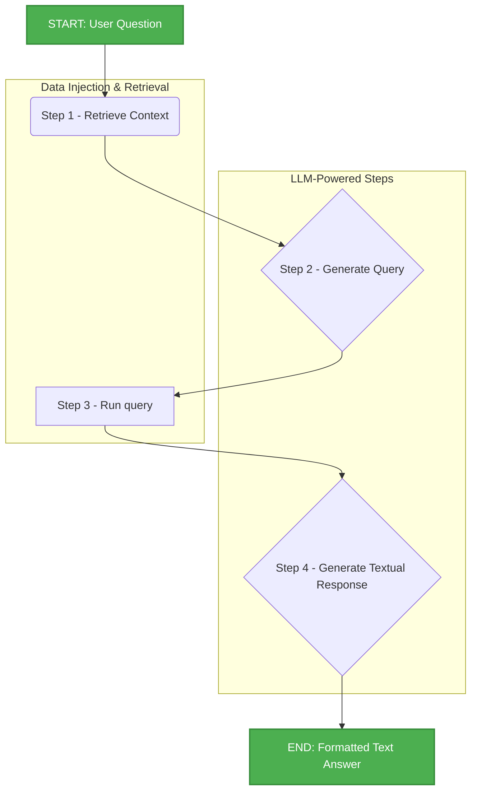

# Input Helper Project 

This project implements an advanced **Question-Answering (Q\&A)** system over **PSR** energy planning models. The core goal is to enable both technical and non-technical users to query the model's complex data structure using **natural language**, translating these questions into structured **Cypher** queries (for Neo4j) and returning clear, textual answers.

-----

## Proposed Development 

The **Text-to-Cypher RAG Agent** acts as an intelligent translation layer, combining the power of **Large Language Models (LLMs)** with a **Graph Database (Neo4j)**.

  * **Accuracy:** Utilizes **Retrieval-Augmented Generation (RAG)** to provide the LLM with contextual Cypher examples and the exact graph schema, ensuring precise and valid query generation.
  * **Meaningful Results:** The raw query result (e.g., a numerical value) is reprocessed by the LLM to be transformed into a friendly, interpretable textual answer.

-----

## 🧩 Key Components

The pipeline is orchestrated by **LangGraph** and uses a configuration file (`agent.yaml`) to define the agent's behavior.

| Component | Function | Technology |
| :--- | :--- | :--- |
| **SDDP Graph** | Stores the model structure (nodes: Plants, Constraints; edges: `LINKED_TO`, `Ref_Fuel`). | **Neo4j** |
| **Schema Processor** | Loads SDDP study files, builds the graph, and extracts the schema (`Nodes` and `Relationships`). | **Python / NetworkX / Neo4j** |
|**Vectorstore Generator** | Creates a vectorstore with Cypher query examples and anti-examples from (`vectorstore_generator/docs/examples.json`) |  **ChromaDB / Embeddings** |
| **Agent (LLM)** | Executes the two-step process: translation (LLM 1) and response formatting (LLM 2). | **LangChain / LangGraph / OpenAI / Anthropic** |
| **RAG Retriever** | Retrive Cypher query examples and antiexamples relevant to the user's question from the vectorstore. | **ChromaDB / Embeddings** | 


-----
## 📁 Vectorstore Generator 

This section explains the crucial process of transforming cypher examples at examples.json into vectorstore for Input Helper Rag.



### Rag Generator
The program `rag_generator.py` creates a vectorstore using the available documents at `docs` folder. It uses `rag_utils.py` and `docs_collector` functions to run the workflow described above. 

#### 1. Data Ingestion and Transformation

The `load_documents` function is responsible for ingesting the structured JSON files:

* **Contrastive Examples (`.json`):** These files are loaded using the LangChain `JSONLoader`. Crucially, the `jq_schema` is set to iterate over the root list (`.[]`), and a custom `metadata_func` is used to flatten the nested data structure.
    * The **`page_content`** is set to the short **`natural_question`** (the string to be vectorized).
    * The full **`correct_cypher`** and **`incorrect_cypher`** objects are flattened and stored in the document's **`metadata`** as simple strings (e.g., `cypher_correto_query`, `cypher_correto_inst`) to satisfy the constraints of ChromaDB.

#### 2. Chunking Strategy (Embedding Unit)

The `create_vectorstore` function processes the loaded documents into final chunks for embedding:

* **Contrastive Examples (Zero-Chunking):** **Each question** extracted from the JSON is treated as a single, complete unit. **No further splitting** is applied. This ensures that the entire semantic context of the question is captured in a single embedding vector, maximizing retrieval accuracy for the RAG step. 

#### 3. Vectorization and Persistence

The process concludes by generating embeddings and saving the database:

* **Embedding Model:** Uses a high-quality embedding model (e.g., OpenAI `text-embedding-3-small`) to convert the text chunks into vectors.
* **ChromaDB:** The generated vectors and their associated metadata are stored in a persistent **ChromaDB** instance. This database serves as the searchable knowledge base for the `retrieve_context` step of the LangGraph workflow.

### Upload vectorstore into S3

After creating the ChromaDB folder containing the vector store, `rag_uploader.py` compresses the vector store into a ZIP file, saves it in the vectorstore directory, and then uses the functions from `api_s3.py` to upload it to Amazon S3.

When you upload your vector store to Amazon S3 (Simple Storage Service), S3 serves as a highly durable, scalable, and secure storage layer. It does not process, index, or interact with the vector data itself—its role is solely to store the files reliably.

### Update Vectorstore

#### Step 1: 

Update the json file, following the existing structure and save it.

#### Step 2: 

Run `rag_generator.py` to generate ChromaDB vectorstores

The default source path is `vectorstore_generator/docs` and the default output is `chromadb`. 

#### Step 3:

`Run rag_uploader.py` to upload the vectorstore into S3. 

---

## ⚙️ Visual Workflow 

The agent's complete workflow is divided into four sequential steps managed by LangGraph.



### Input Data
- LLM model (gpt-4.1 by default)
- SDDP Path 
- User Prompt (question about the case)

### Step 1 - Retrive Context: 
1. Get Sechema: 
    - Creates a graph for the case 
    - Upload this graph to Neo4j database
    - Get entity types, relationships names and names (SCHEMA_DATA)
2. Get examples: 
    - Use a retriver to get the 3 most relevant examples to use as context
    - This examples is retrived according to the user input, and then correct and incorret examples are generated
    - Formata and save at context_str
3. Add context_str and SCHEMADATA to State Node (retrive_contex)

> **_NOTE:_** 
    The examples file is not filled enough. More examples must be added 

### Step 2 - Generate Cypher Query : 
1. Creates System Prompt and System Message with rag_data and SCHEMA_DATA 
2. Creates User Prompt and Human Message with user prompt 
3. Invoke LMM with System Message and Human Message 
4. Add query to State Node (generate_query)

### Step 3 - Run Cypher Query : 
1. Get query gerenerate by previous step
2. Run query on neo4j instance created on step 1.1
3. Conevert result to str 
4. Add result to State Node (execute_query)

**Query Execution, Retry & Treatment**

- **Validation (`validate_cypher_query`)**: Performs basic syntax and safety checks before execution (balanced parentheses/brackets/braces, presence of `MATCH`/`CREATE`/`MERGE`, warns on dangerous operations like `DELETE`/`DROP`). Returns a structured validation result with `is_valid`, `errors`, and `warnings`.
- **Executor with retry (`Neo4jExecutorWithRetry`)**: Wraps the Neo4j driver and executes Cypher with retry logic (uses `tenacity` exponential backoff). Use `execute_query_safe` to run queries: it validates first (optional), executes with retries, and returns a consistent result object including execution logs.
- **LLM-assisted auto-fix (`auto_fix_cypher_query`)**: If a query fails, an LLM-based helper composes a corrected query using the graph schema, the original query, and the error message. The function returns the corrected query only (attempts to preserve original logic and change only what's necessary).
- **Batch execution & attempts (`execute_queries_with_auto_fix`)**: Processes all generated queries, attempts automatic fixes up to a configurable number of retries per query, records per-attempt details (query, result, logs), separates successful and failed queries, and returns a comprehensive summary (counts, successful queries with records, failed queries with final errors).
- **Final orchestration (`execute_all_queries`)**: Calls the batch executor, composes a JSON summary of total/successful/failed queries and their results, logs the outcome, and ensures the Neo4j executor is closed.

### Step 4 - Generate Textual Response : 
1. Creates System Prompt and System Message with empty rag_data and SCHEMA_DATA
2. Creates User Prompt and Human Message with user prompt, cypher query and query result
3. Invoke LMM with System Message and Human Message 
-----

##  How to Run 

### Usage via Command Line

The project uses `argparse` to receive the necessary configuration.

```bash
python your_main_file.py \
    -m gpt-4.1 \
    -s /path/to/your/sddp/study \
    -q "What is the sum of the installed capacity for gas-fired thermal plants?"
```

### Usage via VS Code (Recommended)

Use the provided `.vscode/launch.json` configuration to easily debug and run the workflow by setting the necessary arguments in the `"args"` array.


---

## 🛑 Current Limitations & Future Development 


### Current Limitations (Challenges)

* **Incomplete Property Extraction:** Not all essential properties from the underlying SDDP model are being fully captured during the initial graph creation phase (e.g., properties like **Installed Capacity** are currently missed using the `as_dict` method). This restricts the queryable data.
* **Query Scope Dependency:** The agent's utility is **limited to user questions** that fit within the boundaries of the existing graph structure and RAG examples. It may struggle with highly novel or out-of-scope inquiries.
* **Neo4j Instance Requirement:** The pipeline **requires an active connection** to a Neo4j instance, which necessitates managing credentials and ensuring the database service is running, adding operational overhead.

### Future Development Pipeline

| Priority | Task | Description |
| :--- | :--- | :--- |
| **High** | **Enhanced RAG & Example Base** | Create a comprehensive JSON file with more complex, multi-hop Cypher queries. Implement a more robust retrieval mechanism (e.g., semantic search with a vector database) to improve context injection. |
| **High** | **Add Available Porperty Names** | Add to schema the available names to properties |
| **High** | **State Memory** | If the study is the same, is no necessary to create graph all over again |
| **Medium** | **Agent Configuration Refinements** | Implement iterative improvements to the `text_to_cypher_agent.yaml` prompts, focusing on error handling instructions and better aggregation logic. |
| **Medium/Low** | **Query Rewriting Strategy** | Implement a pre-processing step to rewrite ambiguous or complex user questions into simpler, more direct queries that are easier for the LLM to translate accurately into Cypher. |
| **Low** | **Neo4j Connection Research** | Research and potentially implement methods for establishing a Neo4j connection without requiring traditional username/password authentication, such as using connection tokens or integrated security solutions (if applicable). |
