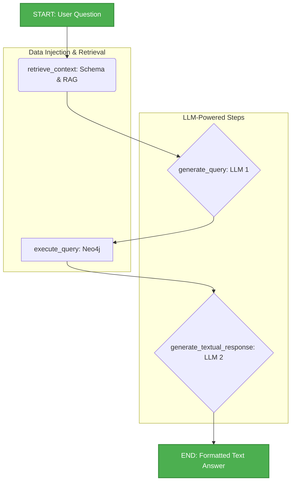

# Input Helper Project 

This project implements an advanced **Question-Answering (Q\&A)** system over **PSR** energy planning models. The core goal is to enable both technical and non-technical users to query the model's complex data structure using **natural language**, translating these questions into structured **Cypher** queries (for Neo4j) and returning clear, textual answers.

-----

## Proposed Development 

The **Text-to-Cypher RAG Agent** acts as an intelligent translation layer, combining the power of **Large Language Models (LLMs)** with a **Graph Database (Neo4j)**.

  * **Accuracy:** Utilizes **Retrieval-Augmented Generation (RAG)** to provide the LLM with contextual Cypher examples and the exact graph schema, ensuring precise and valid query generation.
  * **Meaningful Results:** The raw query result (e.g., a numerical value) is reprocessed by the LLM to be transformed into a friendly, interpretable textual answer.

-----

## 🧩 Key Components

The pipeline is orchestrated by **LangGraph** and uses a configuration file (`agent.yaml`) to define the agent's behavior.

| Component | Function | Technology |
| :--- | :--- | :--- |
| **SDDP Graph** | Stores the model structure (nodes: Plants, Constraints; edges: `LINKED_TO`, `Ref_Fuel`). | **Neo4j** |
| **Schema Processor** | Loads SDDP study files, builds the graph, and extracts the schema (`Nodes` and `Relationships`). | **Python / NetworkX / Neo4j** |
| **RAG Retriever** | Searches for semantically similar Cypher query examples (`sddp_cypher_examples.json`) relevant to the user's question. | **ChromaDB / Embeddings** |
| **Agent (LLM)** | Executes the two-step process: translation (LLM 1) and response formatting (LLM 2). | **LangChain / LangGraph / OpenAI / Anthropic** |

-----

## ⚙️ Visual Workflow 

The agent's complete workflow is divided into four sequential steps managed by LangGraph.



-----

##  How to Run 

### Usage via Command Line

The project uses `argparse` to receive the necessary configuration.

```bash
python your_main_file.py \
    -m gpt-4.1 \
    -s /path/to/your/sddp/study \
    -q "What is the sum of the installed capacity for gas-fired thermal plants?"
```

### Usage via VS Code (Recommended)

Use the provided `.vscode/launch.json` configuration to easily debug and run the workflow by setting the necessary arguments in the `"args"` array.


---

## 🛑 Current Limitations & Future Development 


### Current Limitations (Challenges)

* **Incomplete Property Extraction:** Not all essential properties from the underlying SDDP model are being fully captured during the initial graph creation phase (e.g., properties like **Installed Capacity** are currently missed using the `as_dict` method). This restricts the queryable data.
* **Query Scope Dependency:** The agent's utility is **limited to user questions** that fit within the boundaries of the existing graph structure and RAG examples. It may struggle with highly novel or out-of-scope inquiries.
* **Neo4j Instance Requirement:** The pipeline **requires an active connection** to a Neo4j instance, which necessitates managing credentials and ensuring the database service is running, adding operational overhead.

### Future Development Pipeline

| Priority | Task | Description |
| :--- | :--- | :--- |
| **High** | **Enhanced RAG & Example Base** | Create a comprehensive JSON file with more complex, multi-hop Cypher queries. Implement a more robust retrieval mechanism (e.g., semantic search with a vector database) to improve context injection. |
| **Medium** | **Agent Configuration Refinements** | Implement iterative improvements to the `text_to_cypher_agent.yaml` prompts, focusing on error handling instructions and better aggregation logic. |
| **Medium/Low** | **Query Rewriting Strategy** | Implement a pre-processing step to rewrite ambiguous or complex user questions into simpler, more direct queries that are easier for the LLM to translate accurately into Cypher. |
| **Low** | **Neo4j Connection Research** | Research and potentially implement methods for establishing a Neo4j connection without requiring traditional username/password authentication, such as using connection tokens or integrated security solutions (if applicable). |
